# Chats in the desktop app

The desktop app shows your Chat with Work chats the way the web app does: the sidebar with New chat, search, the Recent chats and what you pinned, the conversation with your questions on the right and the answers in Markdown, the tool work folded into one live line, sources as citation chips, changes to approve and questions from connected services as the web's cards, and the composer with its rainbow edge, model picker and attached files. It talks to the daemon exactly as `cww tui` does ([CHAT_API.md](../CHAT_API.md), [CONTROL.md, "Chats"](../CONTROL.md#chats)): `chats`, `chat`, `chat_send`, `chat_cancel`, `chat_access`, `models`, `chat_upload`, `chat_approve`, `chat_deny`, `chat_answer`, `chat_decline`, `chat_retry`, `chat_branch`, `chat_rename`, `chat_delete`, `chat_share`, `chat_unshare`, a `subscribe` to the `chat` topic while a chat is open, and one to the `chats` topic for as long as the page is open, which keeps the list current. It never holds a token.

Files you attach are read by the app, not the daemon (which can only read shared folders), and sent to it over the control socket, which uploads them to Chat with Work once, when you attach them, as `cww tui` does.

This page is the design spec: how the web's design system (Live Wire, in the web app's `app/assets/tailwind`) maps onto egui, and what egui can't do the same way.

## Where it lives

Chat is a page of the existing window, not a second window. The settings sidebar starts with **Chat**, and `cww-app --page chat` opens on it. On the Chat page the whole window becomes the web's layout, with its own sidebar; the row at the foot of that sidebar (on the web, your name and "Settings and usage") opens a menu of the web's Settings tabs and of these settings pages.

Why one window:

- It keeps the idle discipline in [settings-app.md](settings-app.md): the window, its GL context and its fonts exist only while it's open, and a closed window costs nothing. A second window would need the shell to own two eframe applications, route window events between them, and keep two GL contexts alive.
- The web does the same: settings are a page of the app's shell, beside the chats.
- The chat follows the web's look and the settings follow the platform's, so they don't mix on one screen: each page owns the whole window.

## Tokens

All colors are the web's `tokens.css` values, light and dark, in `app/src/ui/chat/tokens.rs`. The page follows the system's light or dark mode like the rest of the window.

| Token | Light | Dark | Used for |
|---|---|---|---|
| `canvas` | `#F3F5F9` | `#06070B` | the conversation's background |
| `canvas-sunken` | `#EAEEF4` | `#0A0C12` | the sidebar, inline code, citation chips, code block headers |
| `surface` | `#FFFFFF` | `#0F121A` | the composer, the selected chat, New chat, the search field |
| `surface-raised` | `#FFFFFF` | `#141824` | your questions, menus |
| `surface-hover` | `#F1F4F8` | `#161B27` | New chat on hover |
| `ink` / `ink-muted` / `ink-faint` | `#0A0D14` / `#5A6374` / `#7C8599` | `#E9ECF4` / `#8D96AA` / `#636B80` | text, secondary text, labels and icons |
| `line` / `line-strong` | `#D6DCE7` / `#C3CBDA` | `#1C2130` / `#2A3144` | hairlines |
| `live` | `#1E8FE6` | `#44B0FF` | a chat being answered, focus rings |
| `attention` / `negative` | `#D99A06` / `#F0552F` | `#FFC247` / `#FF6644` | a chat needing attention, failures |
| signals | green `#13C977`, blue, violet `#7A3CF0`, orange, lime | brighter on dark | code highlighting, the activity wire |
| rainbow | `#44ff9a` 0%, `#44b0ff` 23%, `#8b44ff` 48%, `#ff6644` 73%, `#ebff70` 99% | same | the composer's edge and glow, the streaming caret, turning rings |

`color-mix(in oklab, …)` is computed in Oklab too (`tokens::mix`), so hovers like "ink at 6%" and the primary button's hover ("ink 84% into canvas") come out the same as in the browser.

Radii: tag 6, control 10, card 14, panel 20, pill fully round. Elevation is the web's: a hairline ring plus one soft drop shadow (`0 20px 50px -24px`), drawn with egui's blurred rectangles.

## Type

The web sets everything in Geist and labels in Geist Mono. The app embeds both (SIL Open Font License, `app/assets/chat/fonts`), as variable TrueType files decoded from the web's own WOFF2 files, and picks weights per run with the `wght` axis: 400 for text, 500 and 550 for titles and buttons, 560 for New chat, 620 for headings in answers, 650 for the greeting. Sizes, line heights and tracking are the web's:

| Text | Face | Size / line height |
|---|---|---|
| Answers (`.prose`) | Geist 400 | 16 / 27.2 |
| Your questions | Geist 400 | 16 / 24 |
| Headings in answers | Geist 620, tracking -0.025em | 24, 20, 17 |
| Sidebar rows, activity line | Geist 400 (title 550) | 14 / 21 |
| Section labels (Recent, Pinned), table headers, `kbd` | Geist Mono 400, tracking 0.02em | 12, 11 |
| Citation chips | Geist Mono 400 | 11 |
| Code | Geist Mono 400 | 14 / 20 |

The settings pages keep the system font.

## Components

Each is drawn to the web component's measurements (from the compiled CSS, checked in a headless browser):

- **Sidebar** (`sidebar.css`, `account_switcher.css`, `sidebar_pins.css`): 288 wide on `canvas-sunken` with a hairline on its right, in the web's order. The logotype (22 high) and the toggle; New chat (a `surface` row with a hairline ring, icon `note-pencil`, `Alt N` hint on hover) and Chats (`chats-circle`, the web's page of every chat, in the browser); the search field (32 high, `Ctrl K` hint); then one **Recent** list of every chat, newest first, as the web's sidebar has it. A chat being answered has a pulsing `live` dot and a shimmering title; one needing attention an `attention` dot. The open chat sits on `surface` with a hairline ring. Below Recent, split by a hairline and scrolling once it's 40% of the sidebar, **Pinned**: the projects pinned on the web (with their Phosphor icons: `buildings` for HQ, `users-three` for All-Access, `folder-simple` for the rest), then the pinned chats (`chat-circle`, still in Recent too), each in pin order, or "Pin a chat or project to keep it here." Pins are as current as the last read of the list, since the web doesn't stream them, and pinning happens on the web: the chat API has no pin. "All projects" on its right opens a picker of every project the person is on, in the web's menu, with a last row opening the web's projects page. A project, pinned or picked, shows its chats in Recent ("Falcon · Show all" beside the label goes back to every chat) and starts a new chat in it, as the web's "New chat here" does: the project's line (`.chat-project`, its icon, its name opening its page, and who reads it) sits between the greeting and the composer, and above a chat in a project. The web counts the people on a project; the chat API doesn't, so the line says "shared with the people on it" (or "everyone in" the organization, for HQ). At the foot, your initials (the web's Gravatar is loaded by the browser, and the server doesn't proxy it) and your name, with the credits meter (`.meter--battery`, "410 of 5,000 credits left", negative at none) while they run low, as the web shows it; it opens a menu with the web's Settings tabs your role opens, which open in the browser, then this computer's own pages (Shared Folders, Always Private, Activity, Account, General). Each chat's row has the web's "Chat options" button (three dots, on hover or focus) opening its menu (`menus.css`: 176 wide, 34-high rows) with Rename and Delete, where the chat's `can` allows them. Rename turns the row into the web's inline field (`.sidebar__rename`) with a check to save; Enter saves and Escape cancels. Delete asks "Are you sure?" first, as the web's `turbo_confirm` does, in the web's dialog style. Pin and Move to project aren't in the chat API, so the menu leaves them out.
- **Responsive**: as on the web, the sidebar is docked from 1024 points wide. Narrower, it's a drawer: a toggle in the top left opens it over the conversation, sliding in over a dimmed backdrop, and choosing a chat or pressing Escape closes it. Wide, the sidebar's own toggle collapses it.
- **Conversation** (`conversation.css`): one column, at most 736 wide, centered, with 16 on each side; 24 at the top and 176 at the bottom so the last answer clears the composer. It scrolls as the web's scroll controller does: opening a chat brings its latest question to 24 under the top, and each new question (asked here, or by someone else in a project chat) scrolls up smoothly to the same place, with the answer writing itself in under it; the page keeps room under a short answer so the question stays there, and doesn't follow the answer down. When the end is out of view, a round "scroll to the latest" button appears over the composer, with a `live` dot while more streams in, and takes you to the end.
- **Your questions**: a `surface-raised` bubble at most 85% (and 576) wide, right-aligned, corners 14 except 6 at the bottom right, padding 10 by 16, with a hairline ring. The files sent with it follow as `.file-chip`s (the file type's icon, the name, the size as Rails writes it, "47.1 KB"), right-aligned and wrapping. Copy, and Retry where the chat allows it, appear under it on hover.
- **Answers**: Markdown (paragraphs, headings, bold, italic, strikethrough, inline code, links, ordered and unordered lists with nesting, quotes, rules, GitHub tables, fenced code), set as the web's typography plugin sets it: paragraphs 20 apart, list items 8 apart with faint markers, tables with mono headers and hairline rows, quotes with a 2-wide `line-strong` rule in `ink-muted`. Code blocks are a hairline card with a `canvas-sunken` header (the language, and Copy), highlighted with the web's signal colors (keywords violet, strings green, numbers and attributes orange, titles blue, comments faint italic). Links that point at one of the answer's sources become citation chips, as `MessagesHelper#chipify_source_links` does on the web. The latest answer shows its actions (`.message__actions`), and the others on hover: Copy, then what the chat's `can` allows: Retry (after the web's "Retry this answer?" dialog), Branch into a new chat (which opens the new chat), and Share (the web's share dialog). Every answer shows its Sources pill (a stack of icons, "Sources", the count) that opens the numbered list of sources, each opening in the browser.
- **Activity** (`activity.css`): one pill-shaped line, "Searched Drive and Slack · 3 searches, read 2 files", with the services' avatars and a caret; it opens into the log of steps on a hairline rail, each with how many files it found ("4 found", the names on hover). While it runs, the title shimmers, the details show the running step's progress, a green spark and a flowing wire lead into the avatars (they retract when it settles), the active avatar pulses, and the rail turns into a green-to-blue gradient.
- **Approvals and questions** (`approval.css`): an answer that stops for the person opens its activity and shows a card at the step that waits, in the attention tint (the negative one, with the warning, for a destructive change): the service's avatar, the mono kicker ("Needs your approval · Slack", "Asks you · Notion"), and one line saying what it is. A change shows what it will write on paper (label and value rows), "Deny with a reason" (a disclosure with one field, at most 500 characters), "Allow this in Slack for the rest of this chat" where it can be, then Deny and Approve. A question shows its form (selects for choices, fields for text and numbers, checkboxes for yes-or-no and for several choices, each with its hint) or the page it asks you to open, with a button that opens it in the browser; then the server's note, Decline, and Send or "I've done it". A step someone else in a project must settle is one line, "Waiting for Ada to approve a change in Linear". The activity line gets an attention dot after its title, and the line above the composer says "Waiting for your approval." or "Waiting for your answer." with Review, which brings the card into view.
- **Dialogs** (`dialogs.css`): the web's modal box (512 or 448 wide, radius 20, padding 24, the float shadow) over the dimmed page: Retry, Share ("Private" with Create public link, or "Public" with the link, Copy, the expiry date and Stop sharing; the link is copied to the clipboard as it's made), the delete confirmation, and "That file can't be attached". Escape or a click outside closes them, as `<form method="dialog">` does on the web.
- **Thinking** (`.thinking`): the mark in a turning rainbow ring with "Thinking", then "Writing" once the answer streams, or "Stopping". A live activity line takes its place, as on the web.
- **Notices** (`notices.css`): failures and running out of credits as a card tinted whole, as the approval card is, never with a stripe down one side: an attention notice on `--attention-wash` with an `--attention-edge` ring, a failure on `--negative-wash` with a `--negative-edge` ring, each with a soft shadow in its tone and the icon in it. A question that didn't go, or a file or model refused, shows the same way over the composer.
- **Composer** (`composer.css`): a `surface` box with radius 20, the float shadow and a 2-wide rainbow edge (70% opaque, full while it has focus) inside a soft rainbow glow (14%, 30% with focus). The field grows with what you type up to 9 lines; Enter sends and Shift+Enter starts a new line, as on the web, and `Ctrl /` (`⌘ /`) focuses it. The paperclip opens the system's file picker (the same portal as the folder picker), and files can also be dropped on the window. Each file is checked as the web's `attachments` controller checks it (`Message::AttachmentPolicy`: never SVG or Flash, otherwise documents, images, audio, video, text and code, at most 25 MB) and shows as Lexxy's chip in the field (`lexxy.css`: 320 by 56 on `canvas-sunken`, a file icon, the name and size, a thin `live` bar while it uploads, and a remove button on hover); while any uploads the paperclip turns its spinner, and with files attached it's inked with a ring. A file the composer won't take gets the web's "That file can't be attached" dialog; one the server refuses comes off with the server's sentence over the composer. A question can be only files. The model picker (`.model-picker`) sits before send: the model's maker's logo, its name and a caret, with its rate as the tooltip; it opens the list of models above it (336 wide), each with its description and rate, the one in use ticked. A model that can't be used now is dimmed with its reason in place of its rate, and choosing it says why instead of picking it. The model picked goes with the next question, which moves the chat to it, as on the web. Send is a 32 square in `ink`, concentric with the box's corner; while an answer is written it becomes Stop, with a rainbow ring turning around it, and the edge flows. Locked (out of credits, nothing connected, a chat you can only read) the box dims, the edge loses its color, and the reason shows above the bar. While sending or stopping, the button says so in its tooltip and accessible name.
- **New chat** (`new_chat.css`): the greeting ("What are we working on, Alex?") over the composer, centered on a faded dot grid.
- **MCP Apps**: a step whose tool has a UI gets a slot in the activity log, a hairline card the width of the column, as `mcp_app.css` draws it. For now the slot draws a placeholder card with the service's name and a button to open the chat in the browser; the Servo-based view, which renders the app's HTML in a helper process and sends RGBA frames, will draw into the same rectangle (`ui::chat::mcp_app::McpAppSlot` takes the frame's texture and reports the rectangle to forward input from). A step says it has a view with an optional `app` (`service`, `uri`) in the chat API's steps; the server doesn't send it yet, so only the stand-in daemon's sample shows the slot.
- **Not ready to chat**: when the agent isn't running, the computer isn't paired, chats aren't allowed yet, or the server can't serve chats, the conversation area shows the web's empty state (dashed card on the dot grid) with the one thing to do: start the agent, pair, ask for access (then "waiting for you to allow it in Chat with Work"), or the reason.

Icons are the web's: Phosphor, bold weight (MIT), rasterized into one alpha atlas (`app/assets/chat/icons.png`) by `app/assets/chat/render.sh` and tinted when drawn.

## Logos and file-type icons

Wherever the web shows an image, the app shows the same one, fetched from the paired server through the daemon (`asset`, [CONTROL.md](../CONTROL.md#asset)) rather than bundled: each model's maker in the picker and its menu, each service in the activity line's avatars, on each step and on the approval and question cards, and each file type's icon on citation chips, in the Sources pill and its list, on the files sent with a question and on the composer's chips once a file is uploaded. They're drawn as the web sizes them (`provider_icon`, `.avatar-stack__item` at 56%, 62% in the Sources pill, rounded 3 on citation chips and in the Sources list, round in the model picker). SVGs are drawn with resvg (MIT or Apache-2.0), PNGs with `image`, each once into a 128-pixel texture. A monochrome logo is drawn white in dark mode, as the web's `dark:brightness-0 dark:invert` does.

Their paths are fingerprinted, so an image never changes: each is kept in memory while the window is open, and on disk under cww's data folder (`chat-assets/<server>/`, the folder `0700` and each file `0600`), so it's fetched once. While one loads, or if the server has none or it can't be read, the page draws what it did before: the service's or model's initial in a round chip, and Phosphor's file icons tinted by type. Where the web draws a glyph instead of a logo, so does the app: `laptop` for a computer, `plugs-connected` for a person's own MCP server, and `list-checks` for an activity that only planned. Loading never asks for frames; the thread that fetches an image wakes the window once, when it's in. The demo daemon serves synthetic images of its own (`app/src/demo/assets`, CC0), which only demo and test builds include.

## Motion

The web's durations and curves, in `tokens.rs`:

| Token | Value | Used for |
|---|---|---|
| instant | 80 ms linear | sidebar row hover |
| fast | 150 ms, `ease-snap` cubic-bezier(0.2, 0.7, 0.2, 1) | button and action hovers, the activity caret turning |
| base | 220 ms `ease-snap` | messages rising in (6 up, from transparent), the scroll button, glow and edge opacity |
| slow | 400 ms `ease-snap` | the activity wire wiring in and out, the greeting rising in |
| wire | 1.2 s linear | the activity wire's flow |
| drawer | 300 ms ease-out | the narrow sidebar sliding in |

Continuous animations, each only while its state holds: the composer edge flows (5 s per loop) while an answer is written; the stop ring and the thinking ring turn (2.4 s); titles of running work shimmer (2 s sweep); the caret at the end of a streaming answer blinks (1 s, stepped); the spark, the active avatar and the sidebar's live dots pulse (1.6 s and 2 s, `ease-glide` cubic-bezier(0.6, 0, 0.3, 1)); the paperclip's spinner turns (0.8 s) and the chips' bars run while files upload.

## Zero CPU when idle

The page asks egui for another frame only while something on it moves: a transition in progress, an answer streaming, a running chat's shimmer and rings. A settled conversation, a chat list, or an empty composer request nothing: no timer, no polling. The text field's caret doesn't blink, since a blinking caret would redraw twice a second. The list stays current over the daemon's `chats` subscription, as Turbo keeps the web's sidebar current: chats started on the web or by someone in a project appear, titles, the answering dot, the model and the public link change in place, a chat deleted elsewhere goes (and, if it was open, closes with "This chat was deleted, or you can't see it anymore."), and the projects, the organization and the credits follow too. A thread blocks on that socket and wakes the window only for a change; its heartbeats don't. With a daemon or server from before live lists, the page falls back to reading the list after its own changes and, while a chat in the list is being answered and isn't the open one, every 4 seconds until it's done, so its dot stops. New text arrives from the follower thread, which blocks on the daemon's socket and wakes the window only when an update comes; the daemon's heartbeat on that socket doesn't redraw. A tool waiting for approval in the browser, or an answer stuck in "processing" on the server, keeps its ring turning, as the web does. The UI tests check that a settled chat stops requesting frames.

## What egui does differently

- **Blur.** CSS blurs the composer's rainbow glow (`filter: blur(20px)`). egui has no filters, so the glow is a feathered ring of gradient-colored vertices around the box, with the same reach and opacity; it reads the same, but it is a smooth falloff rather than a true Gaussian of the gradient.
- **Gradients.** The rainbow edge, wire and caret are meshes with per-vertex colors, interpolated in sRGB, where the browser interpolates gradients in sRGB too; the edge is tessellated finely enough that its colors match.
- **Text.** Glyphs are rasterized by egui with the desktop's hinting (fastframe-text), not by Skia, so stems can differ by a fraction of a pixel and wrapping can break a word earlier or later than the browser. Synthetic italics: Geist has no italic face, which the browser also synthesizes.
- **Web pages' icons.** The web shows a web page's favicon, which the browser asks Google's favicon service for. The server doesn't fetch it for the app, and the app doesn't ask third parties, so a web page among the sources keeps Phosphor's `globe-simple`.
- **Your avatar.** The web shows your Gravatar, which the browser loads from Gravatar; there's no server proxy for it, so the app draws your initials, as the web's fallback does.
- **Upload progress.** Lexxy fills its bar as the browser uploads; the app sends a file to the daemon in one request and hears nothing until it's done, so the bar runs without saying how far.
- **Dialog backdrop.** The web blurs the page behind a dialog (`backdrop-filter: blur(3px)`); egui can't, so it's only dimmed.
- **Reduced motion.** The browser honors "reduce motion"; egui doesn't expose it, so the animations always run.
- **Selecting text.** Paragraphs, headings, list items and quotes in answers, and your questions, select with the mouse (across paragraphs too) and copy with the system shortcut, through egui's label selection. Code blocks and tables don't select; their Copy button and the answer's Copy do.
- **Opening files.** On the web a question's file chips download the file; the chat API doesn't serve attachments, so they're labels here.
- **The caret.** The composer's caret is steady rather than blinking (see above).

## What the chat API doesn't say

The page follows the web wherever the chat API gives it what the web uses. Where it doesn't, the page shows what the web shows in the commonest case:

- **The organization.** The web's sidebar shows the organization switcher only to someone in more than one organization. The chat API names the organization this computer is paired with, not how many the person is in, so the sidebar never shows it, as the web doesn't for someone in one.

## Screens

Rendered offscreen with wgpu by the UI tests against the stand-in daemon's synthetic sample (`cargo test -p cww-app renders_like_the_web`; `UPDATE_SNAPSHOTS=1` rewrites them). On Linux the test compares the page with these, within a small tolerance; elsewhere it only renders. They were checked side by side against the web app's own markup and compiled CSS, rendered by headless Chromium at the same sizes with the same sample.

| | Light | Dark |
|---|---|---|
| A chat | 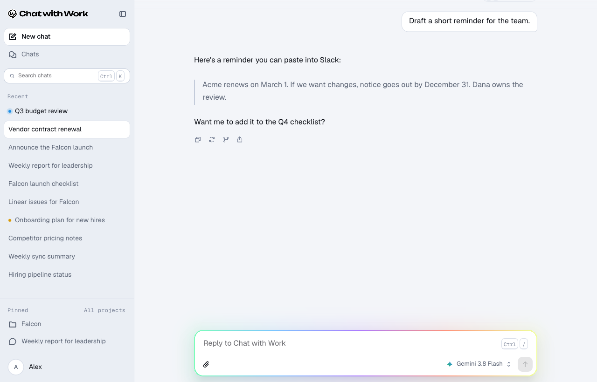 | 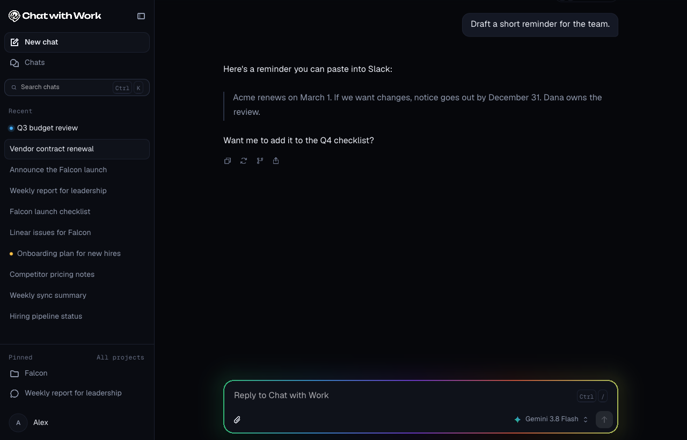 |
| An answer streaming | 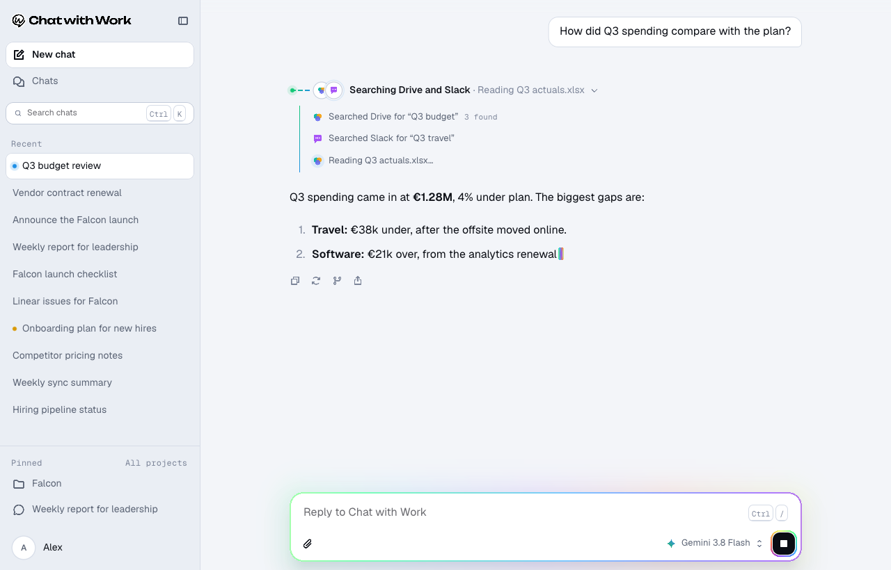 | 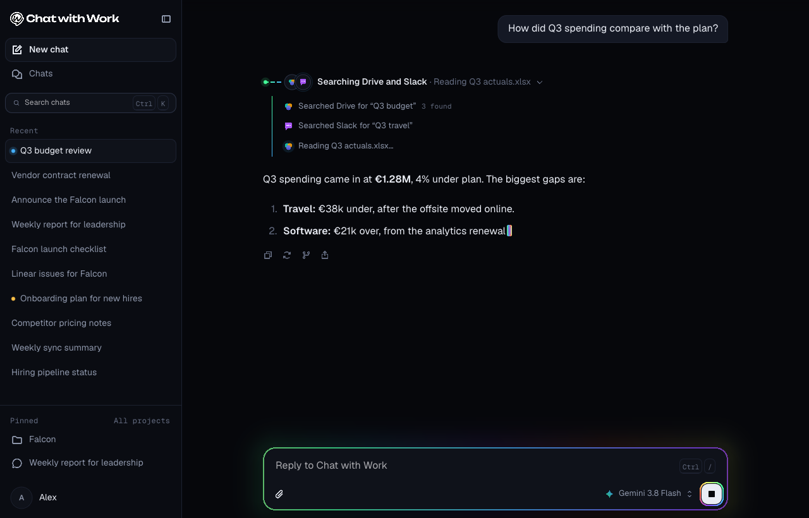 |
| A new chat | 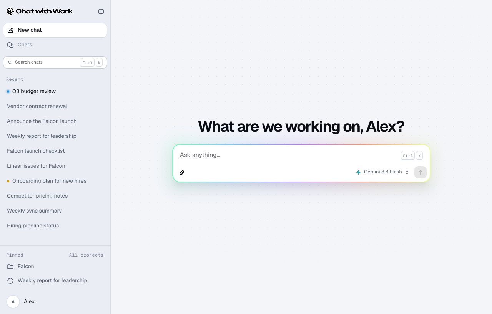 | 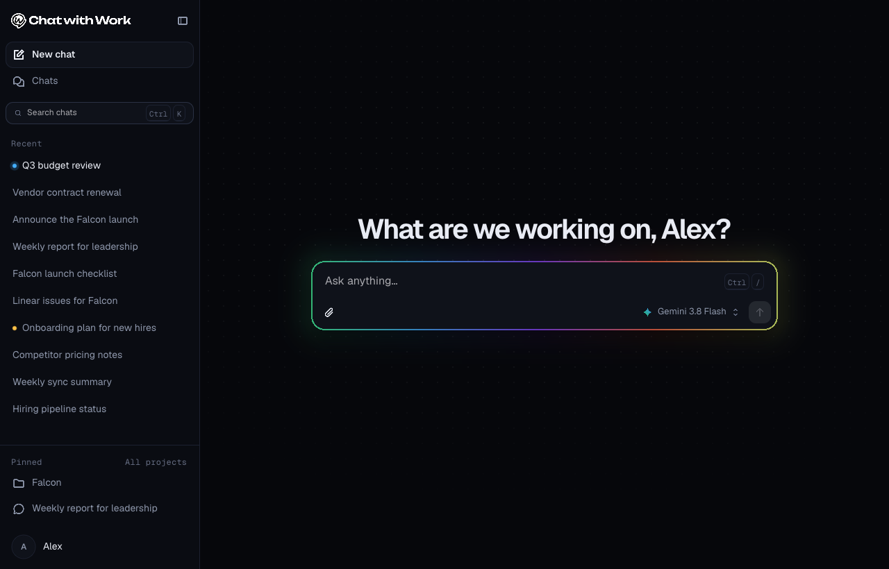 |
| Narrow | 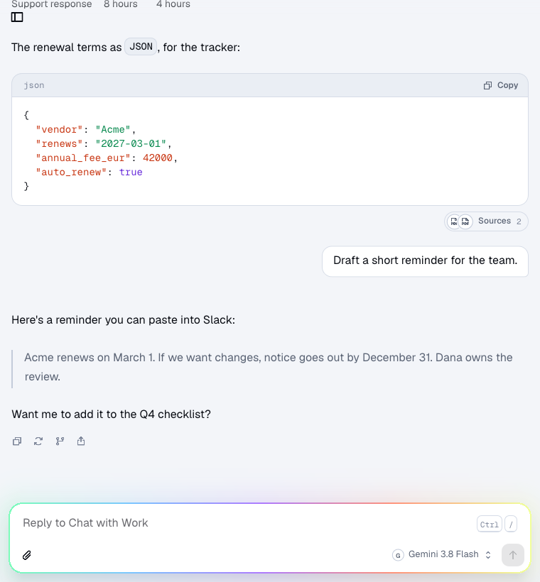 | 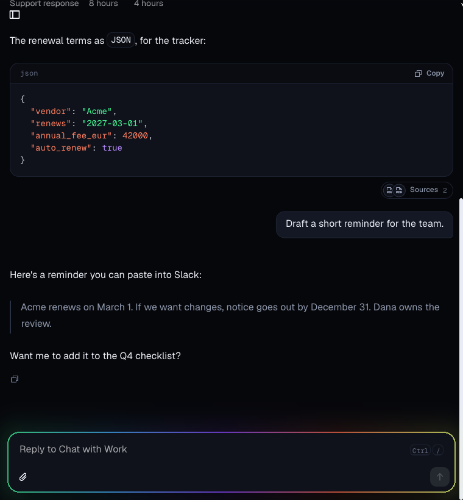 |
| A new chat, narrow | 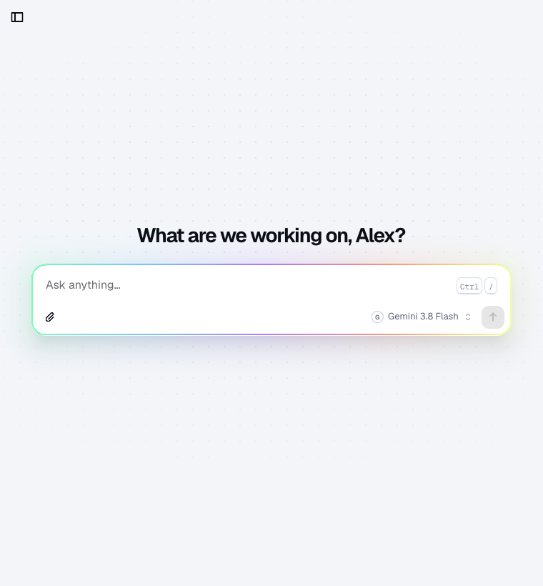 | 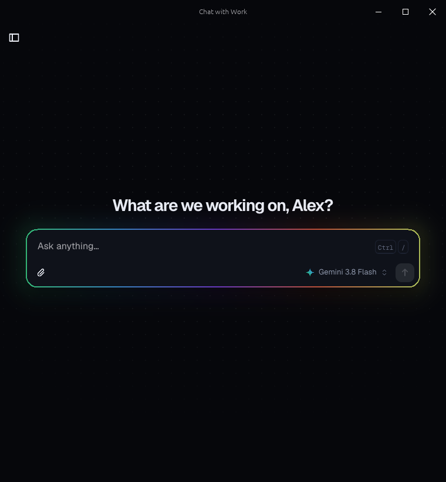 |
| A change to approve | 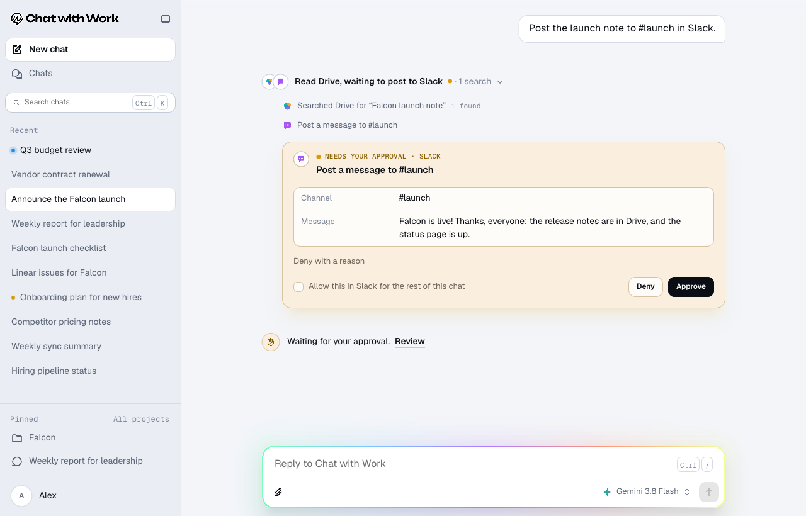 | 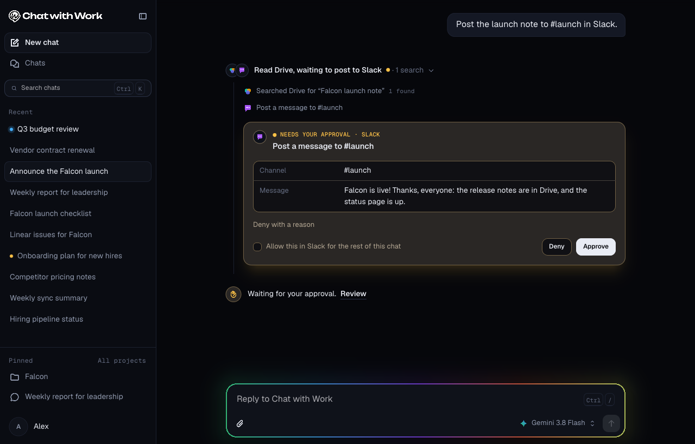 |
| A question from a connected service | 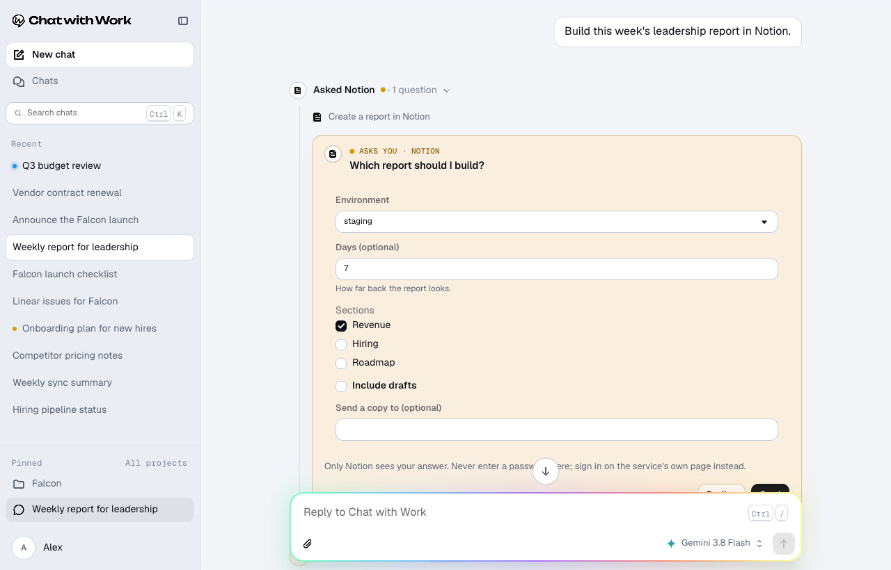 | 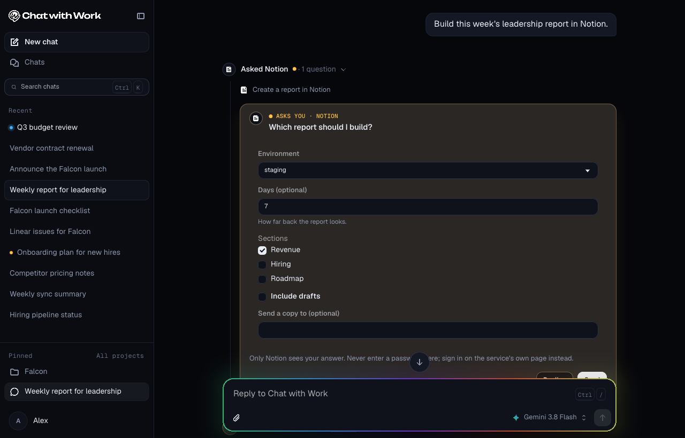 |

`cargo test -p cww-app renders_review_screens` with `CWW_PARITY_DIR` set renders the model picker, attached files, the row menu and rename, and each dialog too, for checking beside the web's own pages.
