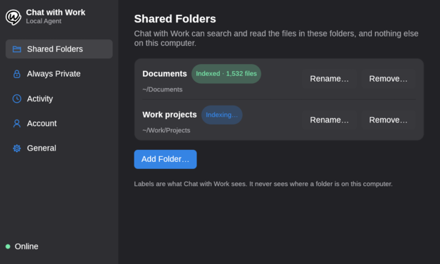
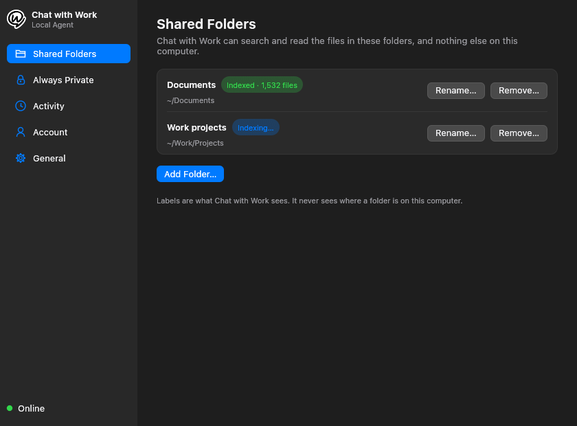
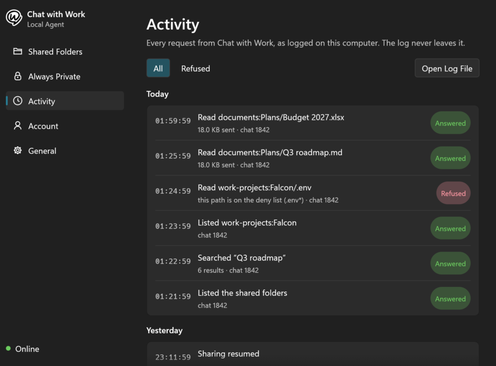
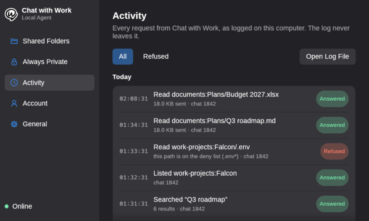
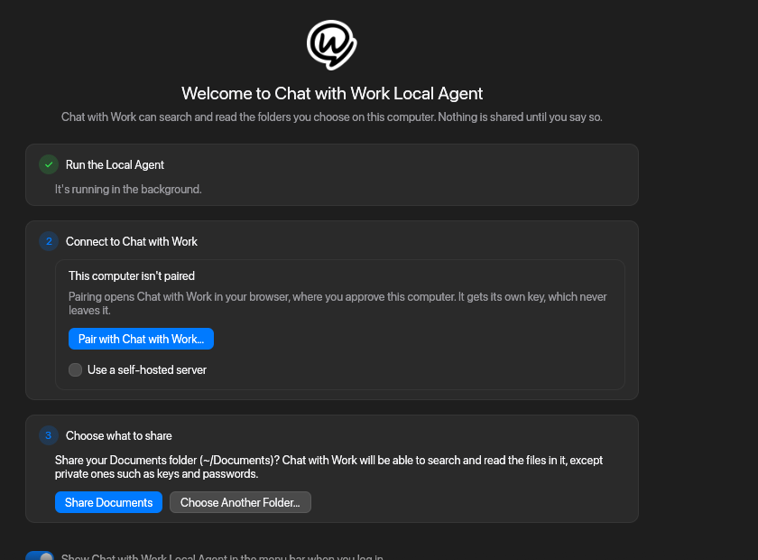
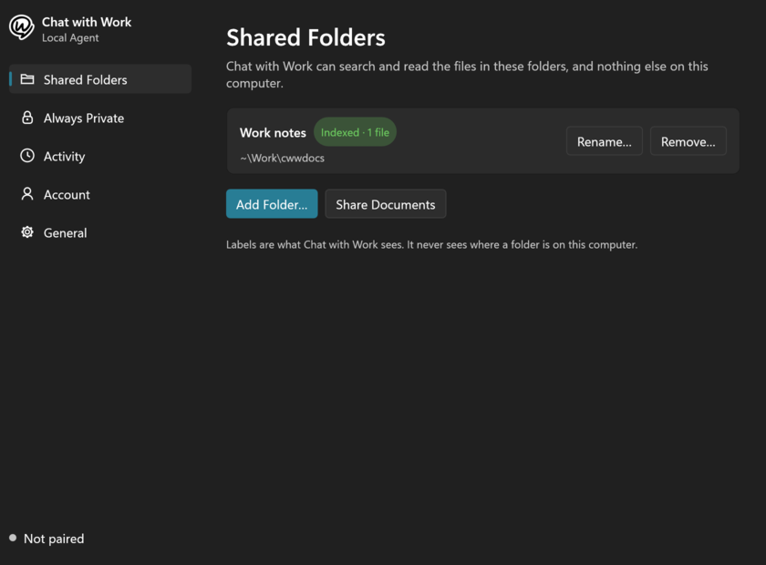

# The desktop app

`cww-app` is the menu bar app and settings window for the Local Agent. It lives in `app/` and talks to the daemon only over the control channel ([CONTROL.md](../CONTROL.md)), with the same client, paths and events as `cww` and its terminal UI. The daemon doesn't need it: servers and people who prefer the command line keep using `cww`.

## What it does

- **Menu bar / tray item:** the state (online, paused, offline, not paired, not running), indexing progress or the last access, Pause Sharing / Resume Sharing, Settings, and Quit. The menu is the platform's own: an `NSMenu` on macOS, a Win32 menu on Windows, and DBusMenu on Linux, drawn by the panel.
- **Settings window:** shared folders (added with the native folder picker, renamed, removed, with each folder's index state), the deny list as information, the local activity log, pairing with the browser-based device flow, start at login, and pausing.
- **First run:** a welcome page starts the agent (`cww daemon install`), pairs, and offers to share the Documents folder. Nothing is shared until the user clicks a button that says so.

## Screenshots

Rendered with `--screenshot`, in each system's dark mode: against the stand-in daemon (`--demo`), and on Windows against the real one.

| Linux (Hyprland) | macOS | Windows 11 |
|---|---|---|
|  |  |  |
|  |  |  |

## Decision: egui, with native menus, pickers and integration

The candidates, against what the app needs:

| | Native look | Binary | Idle cost | Accessibility | Licence | Fits the owner's apps |
|---|---|---|---|---|---|---|
| **egui / eframe (glow)** | Drawn, styled per platform | 15 MB for this app, stripped | Nothing when idle, window or not | AccessKit | MIT/Apache | Yes: Spotifast and ZapFast |
| Slint (fluent, cupertino, qt styles) | Close imitations; qt style needs Qt at run time | Similar | Nothing when idle | AccessKit | GPLv3, or royalty-free with attribution | No |
| iced | Drawn, no platform styles | Similar | Good since 0.13 | Partial | MIT | No |
| gtk4-rs / libadwaita | Native on GNOME only | Needs GTK on macOS and Windows | Good | ATK/AT-SPI | MIT (GTK is LGPL) | No |
| Tauri | Web page in a web view | Small binary, large process | A web view stays resident | Browser's | MIT/Apache | No |
| SwiftUI + WinUI + GTK, one per platform | Fully native | Three small apps | Good | Native | Mixed | No, and three UIs to keep in step |

**egui wins.** It is what Spotifast and ZapFast use (eframe 0.36, glow, AccessKit, `tray-icon`, `ksni`, `rfd`), so the owner already maintains this stack; it is one Rust codebase for three platforms; it is MIT/Apache like the rest of the repository; and it can be made to use no CPU at all when idle (below). Fully native UIs would look best, but three UI codebases in Swift, C#/C++ and Rust are a poor trade for a small settings window, and SwiftUI can't be built in Linux CI.

To make up most of the difference in looks, the parts people touch most are native, and the window follows each platform:

- The tray menu is the platform's own (`tray-icon`/`muda` on macOS and Windows, `ksni` on Linux), not drawn by egui.
- The folder picker is the platform's own (`rfd`: `NSOpenPanel`, `IFileDialog`, the XDG portal).
- The window uses the system UI font (San Francisco, Segoe UI, or the fontconfig `sans-serif`), the user's accent color (macOS and Windows accent settings, GNOME 47's accent), light or dark to match the system, and each platform's control heights, corner radii, grouped-row style, switches, and dialog button order (Cancel last on Windows, first on macOS and GNOME).
- On macOS the app is an accessory app: a menu bar item with no Dock icon. The menu bar icon is a template image, so macOS tints it.

The window is not pixel-identical to a native one: text rendering and focus rings are egui's. If that matters later, the control socket is documented, so a native SwiftUI or WinUI front end can replace the window without touching the daemon.

## Zero CPU when idle

The daemon pushes status changes and audit entries (`subscribe` in CONTROL.md) instead of being polled, and the app never animates while waiting. While the window is closed the app is four threads, all blocked in the kernel:

| Thread | Blocked in |
|---|---|
| main (winit event loop) | `epoll_wait`, until a tray click or a status change wakes it |
| tray (Linux: ksni's D-Bus thread) | D-Bus |
| `cww-watch` | reading the daemon's socket; while the daemon is down, a file-system watch on the socket's directory |
| `cww-instance` | `accept`, for a second launch asking for the window |

The settings window is created when it opens and dropped when it closes, GL context and all, so a closed window costs nothing, and nothing redraws while it is hidden. On Linux the app returns the window's heap to the system with `malloc_trim` when it closes.

Measured on Linux (Arch, Hyprland, release build), per-thread context switches from `/proc`, and CPU time from `/proc/PID/stat`:

| State | 60 s of idle |
|---|---|
| Tray only, daemon running | 0 context switches, 0 ms CPU, 11 MB resident |
| After opening and closing the window | 0 context switches (one tokio wake-up in ksni), 0 ms CPU |
| Window open, untouched | 0 ms CPU; about one wake-up a second from Hyprland's ping of every window |

On macOS (27, Apple silicon), `top` counted no idle wake-ups and no CPU time over 90 seconds in the tray, with a 13 MB footprint. On Windows 11, against the real daemon, the tray-only app had a 12 MB working set (2 MB private) and used one 15.6 ms scheduler tick of CPU in 60 seconds, while the daemon was still reporting its first index pass; against the stand-in daemon it used none.

One dependency needed a fix: `blocking` 1.7.0 (pulled in by zbus for AccessKit's screen reader bridge on Linux) keeps an idle pool thread alive that wakes every 500 ms forever. `app/Cargo.toml` pins 1.6.2, which lets it exit. Upstream should change its exit test back to "idle and timed out".

## Starting at login

- The daemon has its own service, registered by `cww daemon install` (systemd user unit, LaunchAgent). It starts at login whether or not the app runs.
- "Start at login" in the app controls the app itself: an XDG autostart entry (`~/.config/autostart/cww-app.desktop`), a LaunchAgent (`~/Library/LaunchAgents/com.chatwithwork.cww-app.plist`), or the `Run` registry key. The entry passes `--background`, so the app starts in the tray without opening its window.
- The welcome page turns it on when it finishes, with a switch to decline.

## Platform notes

- **Linux:** the tray item is a StatusNotifierItem, which Waybar, KDE, and GNOME with the AppIndicator extension show. Without a tray host the app opens its window and quits when it closes. Dark mode comes from the `org.gnome.desktop.interface color-scheme` setting when the windowing system doesn't report it.
- **macOS:** the app must be in a bundle (`packaging/macos/bundle.sh`) for Finder, Launchpad and notarization; `cww` ships inside it, next to `cww-app`.
- **Windows:** the tray icon is in the notification area; a left click opens the window and a right click the menu. The app talks to the daemon over its named pipe, through the `cww` crate's client, which checks the pipe belongs to the current user.

## Development

```sh
cargo run -p cww-app                         # against the daemon in $CWW_HOME or the default paths
cargo run -p cww-app --features demo -- --demo        # a stand-in daemon with sample data
cargo run -p cww-app --features demo -- --demo-fresh  # a first run
cargo run -p cww-app --features demo -- --demo --page activity --screenshot activity.png
cargo test -p cww-app                        # includes UI tests through the accessibility tree
```

The UI tests drive the window with `egui_kittest` against the stand-in daemon, which records the requests it gets. A test on Unix runs the real daemon and checks the app reads every answer.
